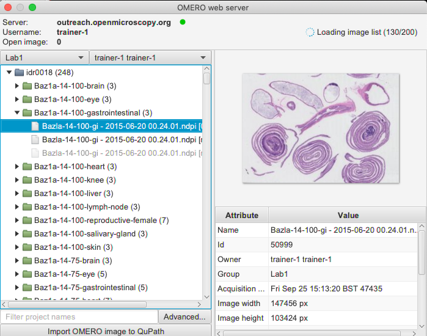
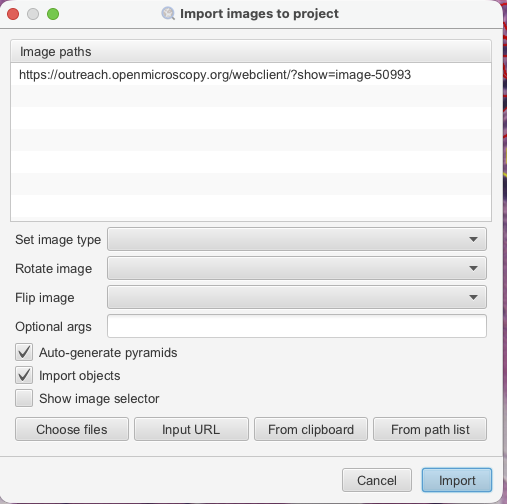
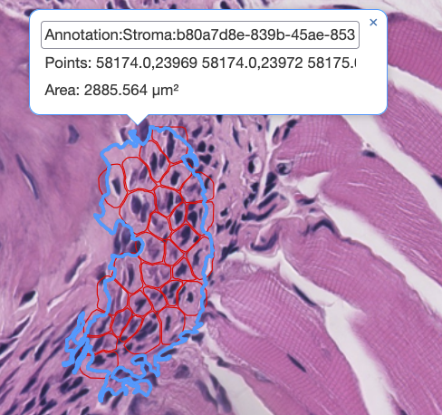

Analyze OMERO data using QuPath
===============================

Description
-----------

QuPath is a cross-platform software application designed for bioimage analysis - and specifically to meet the needs of whole slide image analysis and digital pathology.
See http://qupath.readthedocs.io/.

We will show:

- How to connect QuPath to OMERO.server and browse the data.

- How to open an image including ROIs from OMERO.server in QuPath.

- How to draw an Annotation in QuPath and save it on an image in OMERO as OMERO ROI.

- How to perform simple Cell detection in QuPath.

- How to save the Cell detection ROIs directly to OMERO using a script in QuPath.

Resources
---------

- Data: example images from

  - IDR project referenced as `idr0018 <https://idr.openmicroscopy.org/search/?query=Name:idr0018>`_. Note that the data also have been imported into an OMERO.server where the possibility to write ROIs/annotations exists (not the IDR server itself). See the ``Step-by-step`` section for further details.

- `Video <https://www.youtube.com/watch?v=IffQ18ZQ3mI>`_ showing the usage of the QuPath OMERO extension 
- QuPath documentation describing the `QuPath OMERO extension <https://qupath.readthedocs.io/en/stable/docs/advanced/omero.html>`_.

Step-by-step
------------

.. _OpeninginQuPath:

Opening images with ROIs from OMERO in QuPath
---------------------------------------------

#. You can go through this workflow on any writeable OMERO server. Note that IDR does no longer support the reading of the pixel data via Ice API.

#. In OMERO.web, identify an image in the `idr0018 <https://idr.openmicroscopy.org/search/?query=Name:idr0018>`_ project and the dataset ``Baz1a-14-100-gastrointestinal`` contained in that project or any other large pathology image (preferably). Ultimately though, any planar image will do.

#. Select the first image and double-click on it. This will open the image in OMERO.iviewer, in a new tab of your browser.

#. If on a read-write OMERO server (i.e. not IDR), you can draw and save some ROIs on that image in OMERO.iviewer to be able to open them in QuPath later below, see `OMERO.iviewer guide <https://omero-guides.readthedocs.io/en/latest/iviewer/docs/iviewer_rois.html>`_ for how to do it.

#. Start your locally installed QuPath. Create a new QuPath Project by creating a new empty folder on your machine and dropping this new folder into the main QuPath window. Answer ``Yes`` when prompted.

#. Create a connection to your OMERO server by clicking ``Extensions > OMERO > Browse server > New server`` and paste into the dialog a valid server url including the ``http`` or ``https`` motives, for example ``https://<server>.com``. Details are described in the `Browsing an OMERO server chapter <https://qupath.readthedocs.io/en/latest/docs/advanced/omero.html#browsing-an-omero-server>`_ of the QuPath documentation.

#. Once connection to the server is established, QuPath will pop up a new dialog. In this dialog, select the correct group in OMERO in top left corner and the correct user. Expand Projects and Datasets as necessary, selecting the image with ROIs which you worked on in previous steps.

   |image1|

#. Double click on the image in the tree. In the new window, check the ``Import Objects`` checkbox and click ``Import`` in bottom-right corner.

   |image2|

#. Click on the imported image in your QuPath project to open it in QuPath. Inspect the ROIs imported from OMERO by going into Annotations tab of QuPath.

#. To draw new ROIs or annotations in QuPath, find a region with well-defined cells and nuclei in the image, zoom in.

#. Draw an ``Annotation`` which denotes the region in which the cells will be detected using the ``Wand`` tool |image3|. 

#. Click ``Extensions > OMERO > Send annotations to OMERO``. A dialog will inform you how many ROIs are to be saved. Click ``OK``.

#. Go to OMERO.iviewer, refresh the image and verify that the annotation was saved as an OMERO ROI (polygon).

#. The Class of the ``Annotation`` (such as "Stroma") in QuPath will be indicated in the comment of the ROI in OMERO, such as ``Annotation:Stroma:b80a7d8e-839b-45ae-8538-17e45f07e236:9b20c601-587c-4606-9bfb-7c5c51e1b091:NoName``. If you reopen the image in QuPath again from OMERO, the ROI fetched by QuPath from OMERO will have the correct name of the ``Annotation`` if you gave it one in QuPath as well as the correct class.

#. The QuPath plugin for OMERO described above allows saving of the Annotations drawn in QuPath to OMERO, but it does not enable the saving of "derived" ROIs, such as Cell detection ROIs. To save the Cell detection ROIs use :ref:`Save detection ROIs using QuPath script<Saveroiscript>`.

.. _Saveroiscript:

Save detection ROIs using QuPath script
---------------------------------------
.. warning::
    The feature described in :ref:`Save detection ROIs using QuPath script<Saveroiscript>` was not really designed for saving large amounts of ROIs (thousands) back to OMERO. An attempt to save large amounts of ROIs might result in slow performance or other problems.    

#. Connect QuPath to OMERO, open an image from OMERO in QuPath and draw an ``Annotation`` on it as described in :ref:`Opening images with ROIs from OMERO in QuPath<OpeninginQuPath>`.

#. Select ``Analyze > Cell detection > Cell detection``.

#. You can adjust the parameters. Click ``Run``. This will draw red ROIs around cells and nuclei inside your ``Annotation``.

#. Click on ``Hierarchy`` tab in the left-hand pane of QuPath. Expand the ``Annotation`` you have just run the ``Cell detection`` on.

#. Open the scripting dialog in QuPath `Automate > Script editor` and paste the following code:

   .. code-block:: groovy

      import qupath.ext.omero.core.apis.commonentities.shapes.ShapeCreator
      import qupath.ext.omero.core.imageserver.OmeroImageServer

      def imageData = getCurrentImageData()
      def hierarchy = imageData.getHierarchy()
      def detections = hierarchy.getDetectionObjects()

      println "Found ${detections.size()} detection objects"

      def server = imageData.getServer()

      if (!(server instanceof OmeroImageServer)) {
            throw new IllegalStateException(
               "Current image server is not an OmeroImageServer: ${server.getClass().getName()}"
            )
      }

      def omeroServer = (OmeroImageServer) server
      def imageId = omeroServer.getId()

      println "OMERO image ID: ${imageId}"
      println "Creating OMERO shapes..."

      def shapes = detections.collectMany {
            ShapeCreator.createShapes(it, false)
      }

      println "Created ${shapes.size()} OMERO shapes"
      println "Sending to OMERO..."

      omeroServer.getClient()
            .getApisHandler()
            .addShapes(imageId, shapes)
            .get()

      println "Successfully sent ${shapes.size()} detection shapes to OMERO"

#. Click ``Run``. This saves the detection ROIs you selected in the ``Hierarchy`` tab into OMERO.

#. Go to OMERO.iviewer and refresh the image. Inspect the saved detection ROIs.

   |image4|

.. |image3| image:: images/qupath3.png
   :width: 0.3in
   :height: 0.3in

